<div align="center">



<br>


</div>

<br>

## `> whoami`

```text
Name      Taha Mohamed Adib
Role      Data Science & AI Engineer
Status    Final-year Computer Science Engineering student
Building  OraSight — AI Database Copilot SaaS
Focus     AI systems · backend engineering · cloud · data
Target    6-month PFE internship · Jan/Feb 2027
```

> Turning data into intelligent, production-ready software.

---

## `> featured_projects`

<table>
<tr>
<td width="50%" valign="top">

### 🗄️ [OraSight](https://github.com/TahaMohamedAdib/orasight-saas)

**AI-powered Database Copilot SaaS**

Oracle Database 23ai · Select AI · AI Vector Search · OCI Generative AI · Spring Boot

`AI` `RAG` `LLMs` `Oracle` `Java` `Cloud`

</td>
<td width="50%" valign="top">

### 📱 [Application Budget Mobile](https://github.com/TahaMohamedAdib/Application-budget-mobile)

**Cross-platform personal finance application**

Secure cloud data · budgeting workflows · mobile-first product engineering

`Mobile` `PostgreSQL` `Supabase` `REST` `Product`

</td>
</tr>

<tr>
<td width="50%" valign="top">

### 🧠 [Any Database To Machine Learning](https://github.com/TahaMohamedAdib/Any-Database-To-Machine-Learning-)

**Data-to-ML experimentation project**

Connecting structured data workflows to machine-learning pipelines.

`Python` `ML` `Data` `Automation`

</td>
<td width="50%" valign="top">

### 🌐 [Portfolio](https://github.com/TahaMohamedAdib/Portfolio-Taha-Mohamed-Adib)

**Personal engineering portfolio**

A central place for projects, experience and technical work.

`Web` `Projects` `Engineering`

</td>
</tr>
</table>

---

## `> tech_stack`

**Languages**  
`Python` · `Java` · `SQL` · `JavaScript`

**Backend & APIs**  
`Spring Boot` · `REST APIs` · `FastAPI`

**Data & AI**  
`PostgreSQL` · `Oracle Database 23ai` · `LLMs` · `RAG` · `scikit-learn` · `Ollama`

**Cloud & DevOps**  
`Docker` · `Linux` · `Git` · `Oracle Cloud` · `Supabase`

---

## `> current_mission`

```bash
$ build useful AI systems
$ ship production software
$ learn continuously
$ find the right PFE opportunity
```

<div align="center">

### `taha@github:~$ echo "build. learn. ship."`

[**Explore my repositories →**](https://github.com/TahaMohamedAdib?tab=repositories)

</div>

<!-- Profile activity art refreshes automatically with GitHub Actions. -->
