### <code>taha@github:~$ ./contributions.sh</code>

  

### <code>taha@github:~$ whoami</code>

<table>
<tr>
<td valign="top"></td>
<td valign="top"></td>
</tr>
</table>

 

### <code>taha@github:~$ ls ./featured</code>

**OraSight** — AI-powered Oracle Database Copilot SaaS  
Oracle Database 23ai · Select AI · AI Vector Search · OCI Generative AI · Spring Boot

**SafeSpend** — Personal-finance application with secure cloud data and AI-assisted features

 

### <code>taha@github:~$ cat ./stack.txt</code>

`Python` · `Java` · `SQL` · `PostgreSQL` · `Spring Boot` · `REST APIs` · `Docker` · `Git` · `Linux` · `LLMs` · `RAG` · `Oracle Cloud`

 

### <code>taha@github:~$ cat ./connect.txt</code>

[GitHub](https://github.com/TahaMohamedAdib)

<!-- Contribution art refreshes automatically with GitHub Actions. -->
